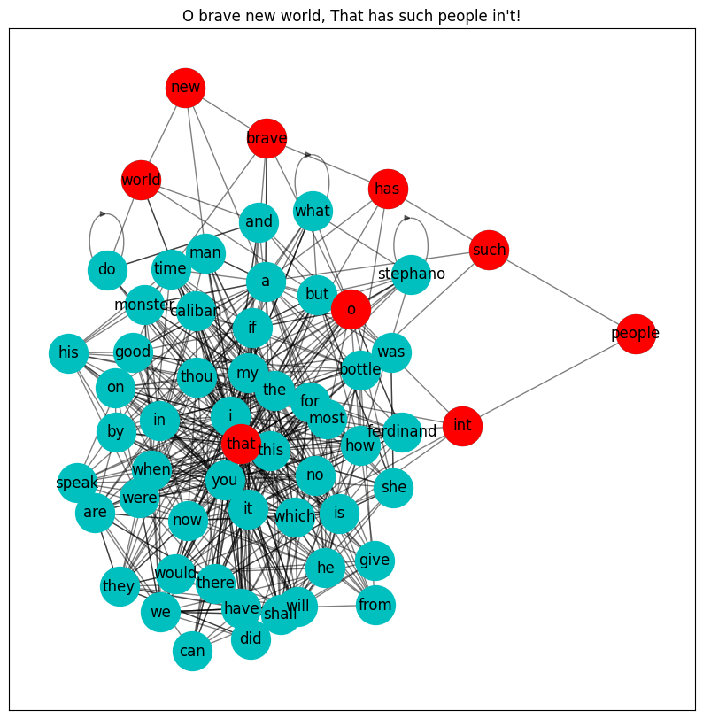

# Markov-Chain Corpus/Generator

Create a language graph from a set of documents. The graph is constructed by treating each document as a markov chain. Functionality for document classification, clustering, and generation is explored. See [`testing.ipynb`](testing.ipynb) for examples of classification, generation, and clustering capabilities. See [`testing2.ipynb`](testing2.ipynb) for an example of oversampling to improve imbalanced classification performance.

The following figure shows a subset of nodes from the text graph generated by Shakespeare's *The Tempest*:

The graph is weighted proportionally to the frequency with which one node (word) follows another in the corpus. Synthetic data can be generated by sampling random walks from the text graph. The likelihood of a given verse can be found by aggregating the weights along its trajectory in the graph; this is useful for classification.
